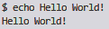
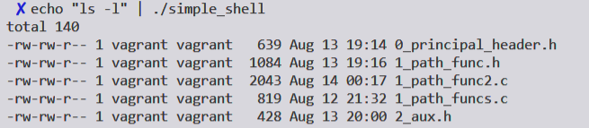
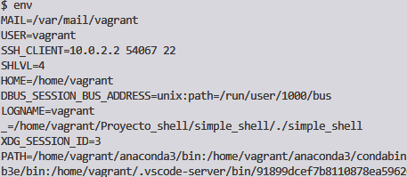

[![Contributors][contributors-shield]][contributors-url]
[![Forks][forks-shield]][forks-url]
[![Stargazers][stars-shield]][stars-url]
[![Issues][issues-shield]][issues-url]


<div align="center">


# Simple Shell
Our simple_shell project must have the same behavior thah sh shell in output and error. Our goal was to learn develop teamwork and imporve individual skills reagarding code.


---
## RESOURCES :books:
</div>

* [Introduction to Linux Shell and Shell Scripting](https://www.geeksforgeeks.org/introduction-linux-shell-shell-scripting/)
* [Tutorial - Write a Shell in C](https://brennan.io/2015/01/16/write-a-shell-in-c/)

* [Building a Linux Shell in C](https://medium.com/@josefgoodyear/building-a-linux-shell-in-c-8be5e109458b)

* [Making your own Linux Shell in C](https://www.geeksforgeeks.org/making-linux-shell-c/)

---
<div align="center">

## Let's start :warning:

</div>

Clone this repo:

```
$ git clone https://github.com/lperezcas16/simple_shell.git
```

Compile with

```
$ gcc -Wall -Werror -Wextra -pedantic *.c -o simple_shell
```

Execute it:
```
$ ./simple_shell
```
<div align="center">

---

## USAGE:  :heavy_exclamation_mark: :heavy_exclamation_mark:

</div>

### INTERACTIVE MODE:

```
$ <command> <flags> <argument>
```
EXAMPLE:

* INPUT:
```
$ echo Hello World!
```
* OUTPUT:
```
 Hello World!
```
<div align="center"> </div>

### NON-INTERACTIVE MODE:

```
$ echo <commands and arguments> | ./simple_shell
```
EXAMPLE:

* INPUT:
```
$ echo "ls -l" | ./simple_shell
```

* OUTPUT
```
total 140
-rw-rw-r-- 1 vagrant vagrant 639 Aug 13 19:14 0_principal_header.h
(...)
```
<div align="center"> </div>
---
<div align="center">

---

## BUILT-IN COMMANDS 


| Command | Description  |
| ------- | --- |
| exit | Exit simple shell|	
| env | Display environment variables |
| setenv | Set environment variable value or create a new one |
| unsetenv | Delete environment variable |


---

## USAGE: :heavy_exclamation_mark: :heavy_exclamation_mark:

</div>

* SETENV:
```
$ setenv <MYVAR> <myvalue>
```

* UNSETENV
```
$ unsetenv <MYVAR>
```

* env

<div align="center"> </div>


---

### AUTHORS
* **Sebastián Paruma** - [sebastianParuma](https://github.com/sebastianparuma) :sunglasses:
* **Laura Perez** - [lperezcas16](https://github.com/lperezcas16) :cat:


[contributors-shield]: https://img.shields.io/github/contributors/lperezcas16/simple_shell?style=flat-square
[contributors-url]: https://github.com/lperezcas16/simple_shell/graphs/contributors
[forks-shield]: https://img.shields.io/github/forks/lperezcas16/simple_shell.svg?style=flat-square
[forks-url]: https://github.com/lperezcas16/simple_shell/network/members
[stars-shield]: https://img.shields.io/github/stars/lperezcas16/simple_shell.svg?style=flat-square
[stars-url]: https://github.com/lperezcas16/simple_shell/stargazers
[issues-shield]: https://img.shields.io/github/issues/lperezcas16/simple_shell?style=flat-square
[issues-url]: https://github.com/lperezcas16/simple_shell/issues
